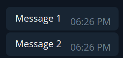
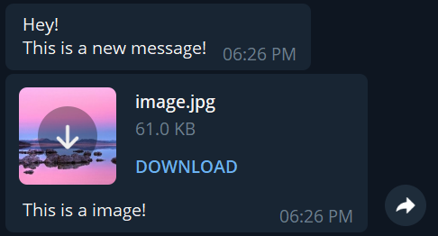
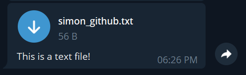
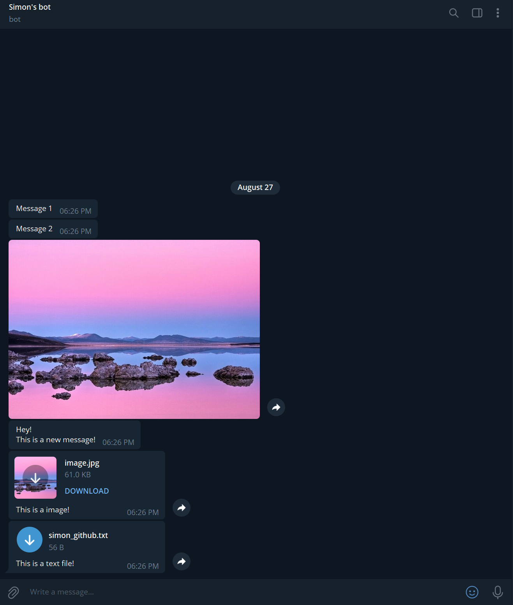

# Telegram-Bot-Push-Message
## How to use it
Talk to bot father, https://telegram.me/BotFather, and send message `/newbot` to create a new bot, follow the instruction, once done, you will get a token
### install the required module (in terminal)
1. `pip install telegram-send` to install the required module
2. `telegram-send --configure` to link to your created bot
#### Then insert the token that you got from bot father, press enter, obtain the passcode from the terminal and send it via the created bot in Telegram chat
#### Done! Run the codes below to send message

<br>

## Result
### Send text message
```
telegram_send.send(messages=["Message 1", "Message 2"])
```


<br>

### Send image message
```
with open("./files/image.jpg", "rb") as image:
  telegram_send.send(images=[image])
```


<br>

### Send a text message and image as a file with caption
```
with open("./files/image.jpg", "rb") as image:
    telegram_send.send(messages=["Hey!\nThis is a new message!"], files=[image], captions=["This is a image!"])
```


<br>

### Send a text file with caption
```
with open("./files/simon_github.txt") as text_file:
    telegram_send.send(files=[text_file], captions=["This is a text file!"])
```


<br>

### overall view

